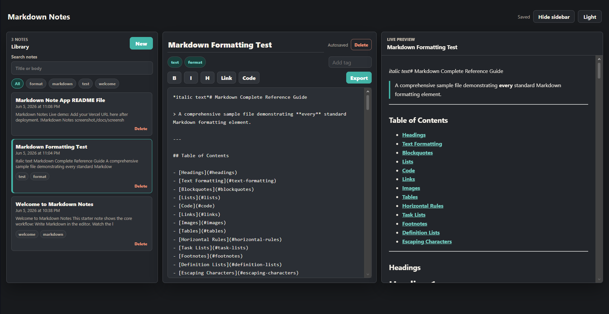

# Markdown Notes

Live demo: _Add your Vercel URL here after deployment._



A responsive Markdown note-taking portfolio project built with React, TypeScript, Vite, CSS Modules, marked, DOMPurify, and highlight.js.

## Features

- Split-pane note list, Markdown editor, and live preview.
- 300ms debounced Markdown preview with sanitised HTML rendering.
- 500ms debounced localStorage autosave and last active note restore.
- Create, rename, delete, search, tag, and filter notes.
- Export the active note as a `.md` file.
- Dark mode that respects `prefers-color-scheme` on first load, with a toggle override.
- Keyboard shortcuts: `Ctrl+N`, `Ctrl+S`, `Ctrl+B`, `Ctrl+I`, and `Ctrl+Shift+P`.
- Responsive tabbed view under 768px.

## Run Locally

```bash
npm install
npm run dev
```

Build for production:

```bash
npm run build
```

## Deploy

Deploy the repository to Vercel and set the framework preset to Vite. After deployment, replace the placeholder live demo link above with your production URL.

## Architecture

The planning diagram is included at [`docs/architecture.svg`](./docs/architecture.svg).
